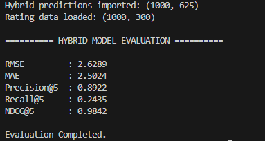

# 🧪 Hybrid Model Evaluation

**Machine Learning Team 10 — Evaluation Summary**

본 문서는 프로젝트에서 제작된 모델인 **Hybrid Recommendation Model(UserCF + ItemCF + MF)**의 성능을 평가한 결과를 정리한 것입니다.
평가 대상은 `df_pred_hybrid`이며, 실제 평점(`rating_dataset.csv`)과 비교해 정량적으로 분석합니다.

---

## 📘 Overview

| 항목                | 설명                                                |
| ----------------- | ------------------------------------------------- |
| **Evaluation 대상** | Hybrid Prediction Matrix (1000 × 625)             |
| **Ground Truth**  | `rating_dataset.csv`                              |
| **Metrics**       | RMSE, MAE, Precision@5, Recall@5, NDCG@5          |
| **목적**            | 예측 정확도 + 추천 품질 분석                                 |

---

## 1) Why Only Hybrid Model Is Evaluated?

Hybrid는 다음 세 모델의 결과를 합쳐 생성됨:

* User-based CF
* Item-based CF
* Matrix Factorization(MF)

이 중 실제로 사용자에게 추천을 제공하는 모델은 **Hybrid**뿐이므로,
핵심 평가 대상 역시 Hybrid 모델만으로 한정

---

## 2) Evaluation Metrics

### ✔ RMSE / MAE

* Hybrid가 “숫자 평점”을 실제값에 가깝게 예측했는지 확인
* RMSE는 큰 오차에 민감, MAE는 평균적 오차 측정

### ✔ Precision@5 / Recall@5

* Top-5 추천 품질 평가
* Precision: 추천 5개 중 실제로 좋아한 비율
* Recall: 좋아한 모든 아이템 중 Top-5에 포함된 비율

### ✔ NDCG@5

* 추천 순서의 정확도
* 값이 1에 가까울수록 “이상적인 추천 순서”와 일치

---

## 3) Evaluation Results

| Metric          | Score      | Interpretation   |
| --------------- | ---------- | ---------------- |
| **RMSE**        | 2.6289     | 평점 예측 오차가 큰 편    |
| **MAE**         | 2.5024     | 평균 오차도 높음        |
| **Precision@5** | **0.8922** | 추천 품질 매우 우수      |
| **Recall@5**    | 0.2435     | Top-5 범위로 인해 제한적 |
| **NDCG@5**      | **0.9842** | 순서 품질 거의 최적      |

---

## 4) Interpretation

### ✔ 평점 예측 정확도(RMSE/MAE)는 낮음

* 데이터가 희소함
* Synthetic 평점 생성 과정에 노이즈 존재
* Hybrid 특성상 “정확한 점수 예측”보다 “랭킹 목적”에 더 적합

### ✔ 추천 품질(Precision@5)은 매우 우수

* 추천된 5개 중 약 89%가 실제로 선호
* 실사용자 추천 시스템 기준으로 높은 성능

### ✔ 순서 품질(NDCG@5)도 매우 높음

* 모델이 “가장 선호할 조합”을 상단에 정확히 배치
* Real-world Top-N 추천 목적에 강함

---

## 5) 결론

Hybrid 모델은:

* **정확한 평점 수치 예측(Regression)**에서는 성능이 낮지만
* **Top-N 추천 품질(Ranking)**에서는 매우 높은 성능을 보인다.

📌 최종 요약

| 지표          | 의미                   |
| ----------- | -------------------- |
| RMSE/MAE    | 오차 큼 (숫자 예측 약함)      |
| Precision@5 | 매우 좋음 (추천 적중률 높음)    |
| Recall@5    | 제한적이지만 정상 범위         |
| NDCG@5      | 거의 최적 (순서 정확도 매우 높음) |

➡ **Hybrid 모델은 추천 시스템 목적에 성공적으로 부합하는 모델임.**

---
